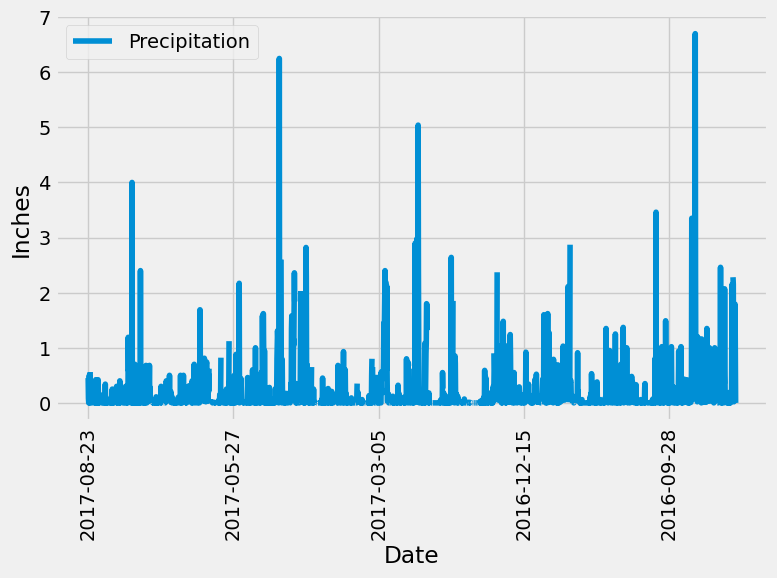

# SQLalchemy-Challenge

# Part 1: Analyze and Explore the Climate Data

In this section, you’ll use Python and SQLAlchemy to do a basic climate analysis and data exploration of your climate database. Specifically, you’ll use SQLAlchemy ORM queries, Pandas, and Matplotlib. To do so, complete the following steps:

Note that you’ll use the provided files (climate_starter.ipynb and hawaii.sqlite) to complete your climate analysis and data exploration.

Use the SQLAlchemy create_engine() function to connect to your SQLite database.

Use the SQLAlchemy automap_base() function to reflect your tables into classes, and then save references to the classes named station and measurement.

Link Python to the database by creating a SQLAlchemy session.

Perform a precipitation analysis and then a station analysis by completing the steps in the following two subsections.

Use Pandas to print the summary statistics for the precipitation data.

# Results

# Station Analysis
Design a query to calculate the total number of stations in the dataset.

Design a query to find the most-active stations (that is, the stations that have the most rows). To do so, complete the following steps:

List the stations and observation counts in descending order.

Design a query that calculates the lowest, highest, and average temperatures that filters on the most-active station id found in the previous query.

Design a query to get the previous 12 months of temperature observation (TOBS) data.

# Results

# Part 2: Design Your Climate App

Now that you’ve completed your initial analysis, you’ll design a Flask API based on the queries that you just developed. To do so, use Flask to create your routes as follows:

1. /
2. /api/v1.0/precipitation
3. /api/v1.0/stations
4. /api/v1.0/tobs
5. /api/v1.0/<start>
6. /api/v1.0/<start>/<end>

